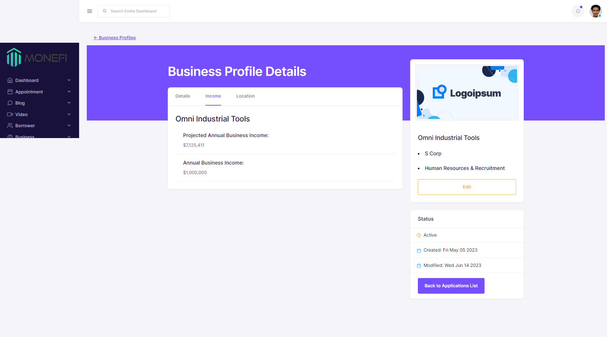

# MoneFi

MoneFi is a dynamic fintech platform empowering minority and underprivileged business owners with lender connections
and educational services, regardless of credit score.

React wizard component created with third-party library [loki-react](https://github.com/JoaoCnh/react-loki)

-Created a business profiles display component with search and filter functionality and built a front-end business profile creation wizard with React.js, implementing AJAX calls with Axios, and leveraging third-party libraries, including Loki, Formik, React-Bootstrap, and Yup for data validation.

-Developed and implemented parameterized stored procedures, queries, User-Defined Types (UDTs), and tables using SQL. Leveraged joins and foreign keys to effectively establish complex relationships across multiple tables.

-Utilized .NET Core framework and C# to create custom models, domains, interfaces, and services. Designed RESTful API endpoints to enable robust connectivity between front-end and back-end components.

-Implemented user roles as a dropdown selection when registering with React.js, to allow the user to add multiple roles to their account, with all of the encompassing services and stored procedures.
